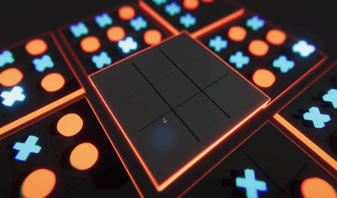

# Self-Play TicTacToe AI (ML-Agents)

### Versions

- Unity: 2020.1.0f1+

- ML-Agents: 1.0.3+ (Release 5)

- ML-Agents (Python): 0.18.1

- TensorFlow: 2.3.0

## Quickstart

### Inference

A pretrained model is already included. Start up Unity, press play and try to win (It's possible).



### Training

Make sure you have the ML-Agents Python package installed. For guidance, check out this [page]([ml-agents/Installation.md at release_6_docs · Unity-Technologies/ml-agents · GitHub](https://github.com/Unity-Technologies/ml-agents/blob/release_6_docs/docs/Installation.md)). This project was tested with Python 3.6.8 on MacOS Catalina with the ML-Agents Python Package v.0.18.1 installed.

First open up the terminal and cd into the "runs" folder of the repo. 

```bash
cd Self-Play-TicTacToe-AI-ML-Agents-/ML-Agents\ runs
```

Then start the ML-Agents trainer referencing the trainer config located in this repo ("ML-Agents config/TicTacToe.yaml").

```bash
mlagents-learn ../ML-Agents\ config/TicTacToe.yaml --run-id="TicTacToe-0"
```

Now press play in the Unity Editor and the training should start. A script automatically reduces the animation and graphic settings to ensure a better training performance. Depending on your machine, you should achieve good results after 1 to 3 hours of training. 

#### I want to use an updated version of ML-Agents

This project will probably work with the next few release versions of ML-Agents if no major changes occur. Make sure you have the latest ML-Agents Python package installed. Then, update the ML-Agents package through Unity's package manager if to prevent any version discrepancies between the package and the python communicator. 


#### About me

Check out my Youtube: [Sebastian Schuchmann - YouTube](http://youtube.com/c/SebastianSchuchmannAI)

or Medium: https://medium.com/@schuchmannsebastian

for A.I. / Machine Learning related content
